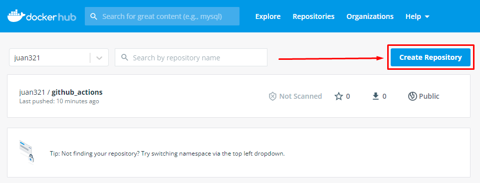
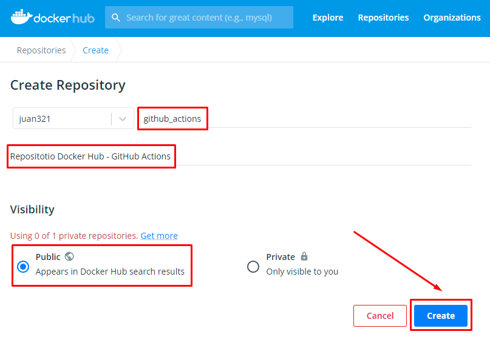
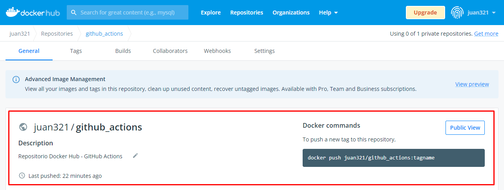
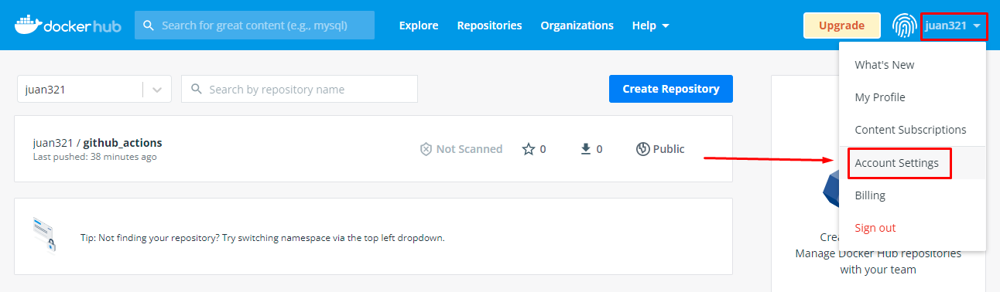
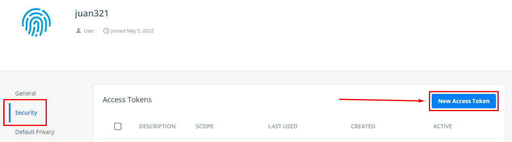
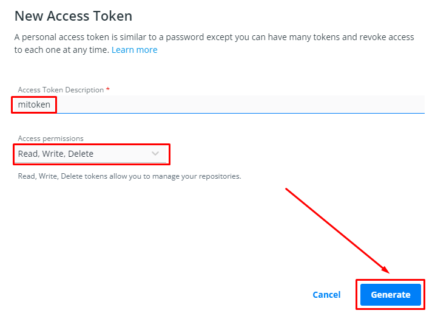
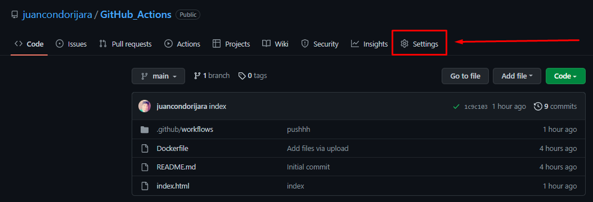
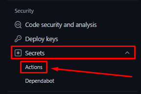
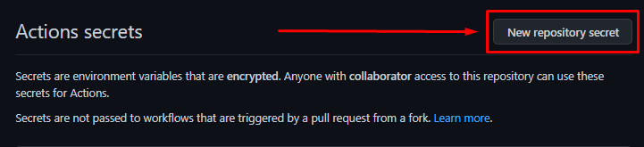
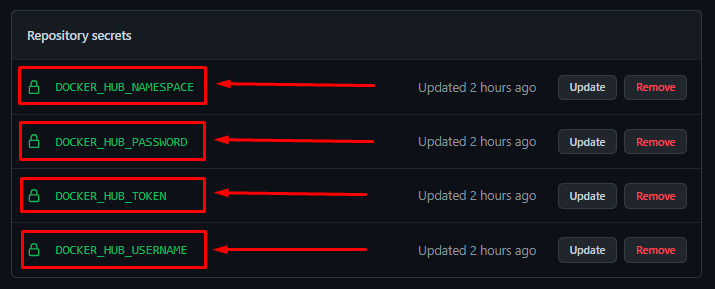

# **Github Actions - Demo**

## **Herramientas y tecnologías usadas**

- Docker Desktop Windows / Ubuntu 18.04

## **Creando carpeta de proyecto**

- Crear carpeta .github/workflows

- Crear el archivo **push.yml**

- Definiendo la acción:

    * Nombre de la acción.

    * Evento de ejecución.

    * Definir sistema operativo (ubuntu).

    * Usar los secrets de GitHub

## **Crear repositorio en Docker Hub**

- Click en el botón Create Repository

- Colocar un nombre, descripción, de manera publica y le damos en Create

- Se creará el repositorio

## **Generar token de Docker Hub**

- Ingresar a Account Settings

- Ir a la opción de Security y dar click New Access Token

- Ingresar descripción, definir los permisos del Token y click en Generate

## **Crear los secrets en el repositorio de Github**

- Ir al repositorio en Settings

- Ir a la opción de Security / Secrets / Actions

- Click en New Repository Secret

- Crear los siguientes secrets con los datos de nuestro Docker Hub

    - DOCKER_HUB_USERNAME
    - DOCKER_HUB_PASSWORD
    - DOCKER_HUB_TOKEN
    - DOCKER_HUB_NAMESPACE

